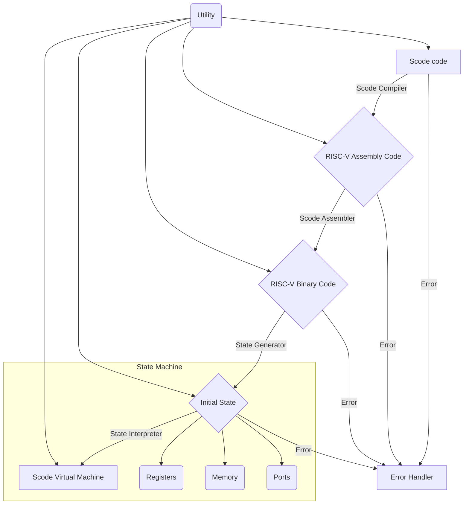

# SCode Tools
---
## SCode is the set of software used to compile down to Risc-V binary code


---

## SCode Compiler
The compiler software, SCode is designed to compile to RISC-V code.

---

## SCode Assembler
#### The SCode Assembler assembles code from RISC-V assembly-like code into RISV-V binary code.
An example of this code would be:
```s
SCode Assembly 1: For test purpose only; Valid Case label and comments
# for loop using x16 as i, x17 as n
# initialize i to 0
addi 16 0 0
# initialize n to 10
addi 17 0 10
# define start of the loop
define label_start
# if i >= n jump to end of the loop
bge 16 17 label_end
# print i
output 0 16
# increment i by 1
addi 16 16 1
# jump to start of the loop
jal 1 label_start
# define the end of the loop
define label_end
# terminate the program
end
```

---

## SCode Virtual Machine (SVM)
#### The SVM is a virtual machine designated for executing binary files generated by the assembler.
##### SVM data storage structure
SVM is a state machine, where each state consists of four parts:
1. Base Registers: SVM is designed to have 32 base registers, which are numbered 0 to 31; each register serves a different purpose.
2. Memories: SVM is designed to have $2^{34}$ bits of memory. To optimize the virtual machine (not allocating the entire memory at once), the memory is represented by a doubly-linked list with a hashmap to all the instructions for jump use.
3. State Machine: SVM will run state to state; each instruction will have an input state and an output state, where we can print the state machines to see how the program is run.
4. IO Ports: SVM will support IO instructions as an extension; each state will accept input and output from those ports.

---

## SCode Error Handler
#### The SCode Error Handler handles exceptions generated from the code.
Errors in SCode are normally handled by wrapped variables. Where the field returned from a function is returned by a wrapper `std::pair`. The error code will be an integer value, which will be gathered together and handled by the `Error_Out` class.
As an example:
```c++
// R-type Instruction add: rd = rs1 + rs2
std::pair<Word, int> Gen_Code::ADD(unsigned int rd_, unsigned int rs1_, unsigned int rs2_) {

    // Check if all registers are in range
    if(!Utility::is_in_range(rd_, 1, 31)) return std::pair<Word, int>{Word{}, 1};
    if(!Utility::is_in_range(rs1_, 0, 31)) return std::pair<Word, int>{Word{}, 2};
    if(!Utility::is_in_range(rs2_, 0, 31)) return std::pair<Word, int>{Word{}, 3};


    // Define constant values
    const unsigned int funct7 = 0x00;
    const unsigned int funct3 = 0x0;
    const unsigned int opcode = 0b0110011;


    // Calculate result
    Word result{};
    result+=
        (Word{funct7} << 25) +
        (Word{rs2_} << 20) +
        (Word{rs1_} << 15) +
        (Word{funct3} << 12) +
        (Word{rd_} << 7) +
        (Word{opcode});


    return std::pair<Word, int>{result, 0};


}
```
And its handler:
```c++
// Output error message
void Error_Out::out_error(int error_code_, int line_number_, std::string error_information_) {

    switch (error_code_) {
    case 1:
        std::cout << "Invalid rd on line " << line_number_ << "." << std::endl;
        break;
    case 2:
        std::cout << "Invalid rs1 on line " << line_number_ << "." << std::endl;
        break;
    case 3:
        std::cout << "Invalid rs2 on line " << line_number_ << "." << std::endl;
        break;
    
    default:
        break;
    }

}
```

---

## SCode Files
This section introduces the purpose of each file that exists in the repository, as well as the function that has already been implemented.

- [ ] SCode Compiler
- [x] SCode Assembler
  - [x] Code Interpreter (`construct_risc_v.hpp`)
  - [x] Binary Code Generator (`generate_code.hpp`)
- [x] SCode Data Storage
  - [x] Basic Memory Cell (`memory_cell.hpp`)
  - [x] Base Registers (`reg.hpp`)
  - [x] Memories (`memory.hpp`)
  - [x] Ports (`ports.hpp`)
- [ ] SCode Virtual Machine
  - [x] State Structure (`state.hpp`)
  - [x] State Generator (`construct_state.hpp`)
  - [x] State Step Interpreter (`generate_state.hpp`)
  - [ ] State Debugger (`svm_debugger.cpp`) *NEW* [^1]
- [x] Error Handling
  - [x] Error Indicators (`error_output.hpp`)
- [x] Miscellaneous
  - [x] Utilities (`utility.hpp`)
  - [x] Testing (`test_client.cpp`)
  - [x] Basic Storage (`word.hpp`)

Note that the testing `test_client.cpp` is the only non-header file and contains main, since `test_interface.hpp` is used to include all header used in the project.

[^1]: Note that the State Debugger (SVM_Debugger) is stored in the branch svm_prod_1

---

## SCode Testing (STests)
#### STests are designed for suite testing for SCode/RISC-V/C++ development.
##### Prerequisites
1. STests are shell scripts, meaning that they are designed to run under Linux environments.[^2]
2. STests require Makefile; thus, Makefile must be installed in your Linux distribution.
3. STests test for memory leaks in C++ with Valgrind; thus, Valgrind must be installed in your Linux distribution.

[^2]: Note that the development of SCode is down under WSL2 (Windows Subsystem for Linux) with Ubuntu.

##### How to use STests
In order to use STests, you must have your folders layout as follows:
```bash
.
├── bin
├── scripts
│   ├── makefile
│   └── run_test.sh
├── src
└── tests
    ├── files
    ├── inputs
    ├── outputs-actual
    ├── outputs-expected
    └── valgrind-actual
```

The commands for running STests are `bash run_test.sh` or simply `./run_test.sh`. However, you must give permission for using `./`. The command to give permission is `chmod +x run_test.sh`. Note that you have to `cd` into `scripts` to test.

To run STests, you would need to put all your source files (C++) into the `src` folder. As well as your Makefile into the `scripts` folder.

You have the option to change the Makefile for your program to compile different files. The default C++ version is C++11 for the tests; you also have the option to change that in the Makefile.

The compiled files, including `*.o`, `*.d`, and the executable file, will be generated automatically into the `bin` folder. These files will be deleted automatically after tests are completed.

It is optional to use automatic test suites where you put `*.in` files in the `tests/inputs` folder, as well as the `*.out` files in the `tests/outputs-expected` folder.

If you use the automatic test suites, the result `*.out` file will be generated in the `tests/outputs-actual` folder. `*.val` files will be generated in the `tests/valgrind-actual` folder. These files are generated for you to verify program correctness and test for memory leaks, respectively.

Note that the script would compare the difference between files in the `tests/outputs-expected` folder and the `tests/outputs-actual` folder. Valgrind errors will also be explicitly displayed so that it is helpful to debug with STests.
